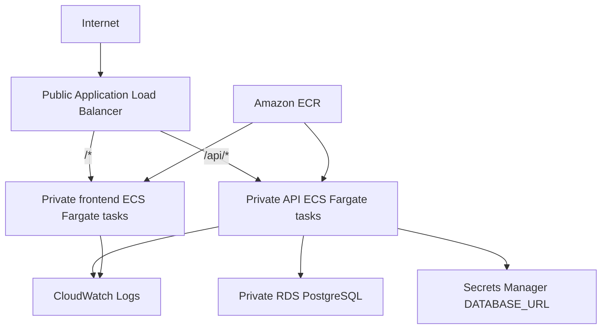

# Terraform Infrastructure

Phase 18B adds the first AWS development environment definition for Agentic Business Analytics Investigator. It defines the infrastructure needed for a later ECS deployment, but it does not build images, push images, run migrations in AWS, apply Terraform, or create cloud resources.

The configuration is one Terraform root module split into focused files under:

```text
infrastructure/terraform/environments/dev/
```

Reusable modules are intentionally deferred until a second environment creates real duplication.

## Target Architecture



The ALB is public because it is the internet entry point. Frontend and API tasks are placed in private application subnets with no public IP addresses. PostgreSQL is placed in private database subnets and accepts traffic only from the API task security group.

## What This Defines

- VPC with DNS support and hostnames enabled.
- Public subnets for the Application Load Balancer.
- Private application subnets for ECS Fargate tasks.
- Private database subnets for RDS PostgreSQL.
- Internet gateway and route tables.
- Optional single NAT gateway for development egress.
- Security groups for ALB, API tasks, frontend tasks, and PostgreSQL.
- ECR repositories for backend and frontend images.
- RDS PostgreSQL 16 with encrypted storage and automated backups.
- Secrets Manager secret containing the API `DATABASE_URL`.
- CloudWatch log groups for API, frontend, and backend one-off tasks.
- IAM execution and task roles with narrow secret access.
- Application Load Balancer, target groups, and HTTP path routing.
- ECS cluster plus conditional task definitions and services.

## Network Tiers

The subnets are separated by purpose:

- Public subnets host only the internet-facing ALB.
- Private application subnets host frontend and API ECS tasks.
- Private database subnets host RDS PostgreSQL.

This keeps task and database resources off the public internet. It also leaves room for future production changes, such as additional private routing, VPC endpoints, or per-AZ NAT gateways, without reshaping the entire VPC.

## NAT Gateway Tradeoff

`enable_nat_gateway` defaults to `true` and creates one NAT gateway in the first public subnet. One NAT gateway is cheaper than one per availability zone, which is appropriate for this development environment. It is not availability-zone redundant. A serious production environment may use one NAT gateway per AZ or VPC endpoints based on reliability, cost, and traffic requirements.

## Database And Secrets

The RDS database is not publicly accessible. The database security group allows PostgreSQL only from the API ECS task security group, not from the ALB, frontend tasks, or the internet.

Terraform generates the database password with the random provider, creates the RDS instance, then stores a SQLAlchemy-compatible `DATABASE_URL` in AWS Secrets Manager for ECS injection into the backend containers.

The password and full `DATABASE_URL` are not output by Terraform and are not stored in example variable files. They do exist in Terraform state because Terraform manages the RDS password and secret value. Protect local state files and configure a secure remote backend before shared use.

## ECS Services Are Disabled By Default

`create_ecs_services` defaults to `false`. With that default, Terraform can define the infrastructure foundation without creating unusable ECS services or task definitions that reference images that do not exist.

Phase 18C should:

1. Build backend and frontend images.
2. Push commit-tagged images to ECR.
3. Set `api_image_uri` and `frontend_image_uri`.
4. Enable `create_ecs_services`.
5. Run migrations as a separate ECS one-off task before normal API traffic.

The backend image is reused for API, migration, and synchronization tasks with different commands: `api`, `migrate`, and `sync`. The API service explicitly disables startup migrations and output synchronization.

## Frontend Build Constraint

The current frontend image is a Vite static build served by nginx. `VITE_API_BASE_URL` is used at build time in `frontend/Dockerfile`, not as a runtime ECS environment variable. Phase 18C must build the frontend image with the intended API base path, currently `/api`.

Local Compose nginx still proxies `/api` to the local API container. The cloud ALB will route `/api/*` directly to the API target group, so local and cloud routing are allowed to differ.

## Initialize And Validate

Create local variables from the safe example:

```bash
cp infrastructure/terraform/environments/dev/terraform.tfvars.example infrastructure/terraform/environments/dev/terraform.tfvars
```

Validate without AWS credentials or remote state:

```bash
sh scripts/verify_terraform.sh
```

The script runs:

```bash
terraform fmt -check -recursive infrastructure/terraform
terraform init -backend=false
terraform validate
```

`terraform plan` would calculate AWS resources to create and may require AWS credentials. `terraform apply` is deliberately not part of Phase 18B because this phase is reviewable infrastructure code only. Do not apply until the account, state backend, cost expectations, and deployment sequence are ready.

## State Backend

The active configuration uses local state for validation. `backend.tf.example` shows a future S3 backend with placeholders. Copy it to `backend.tf` only after the S3 bucket and DynamoDB lock table exist. Do not put secrets in backend configuration.

## Cost-Sensitive Resources

The development defaults are modest and are not production recommendations:

- NAT gateway: useful for private subnet egress, but billed while provisioned.
- RDS PostgreSQL: `db.t4g.micro`, 20 GiB, no Multi-AZ, deletion protection disabled.
- Application Load Balancer: billed while provisioned.
- Fargate: one API task and one frontend task only when services are enabled.
- CloudWatch Logs: 14-day retention by default.

To avoid accidental charges, do not run `terraform apply` during this phase, keep ECS services disabled until real images exist, and destroy any future test environment when it is no longer needed.

## Current Limitations

- No Terraform apply has been performed.
- No remote state resources are created.
- No application images are built or pushed.
- No ECS services run until real image URIs are supplied.
- No AWS migrations are run.
- No GitHub OIDC deployment workflow exists yet.
- No HTTPS, domain, Route 53, or ACM certificate configuration exists yet.
- No production monitoring, alerting, authentication, or authorization is configured.
